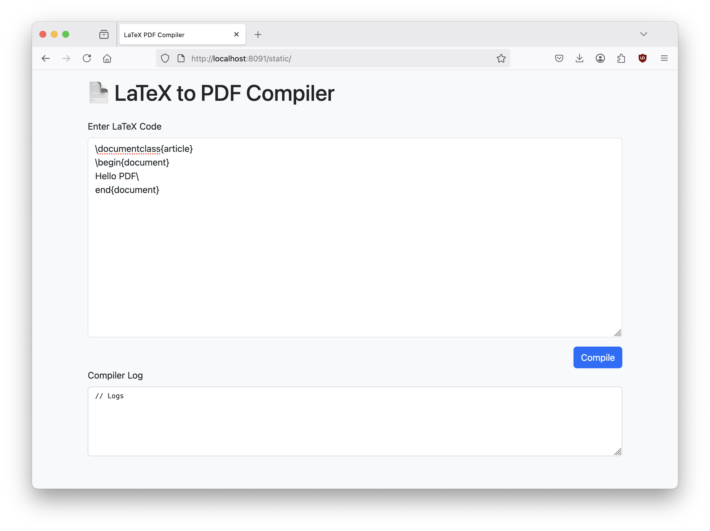

# latex-pdf-server

> A minimal web-based LaTeX-to-PDF compiler written in Go, using Gin and WebSocket for
> real-time compilation logs. Supports LaTeX input either via a browser interface or a **POST** and returns
> a downloadable PDF.

```bash
curl -X POST http://localhost:8080/compile \
  -H "Content-Type: application/json" \
  -d '{"latex": "\\documentclass{article}\\begin{document}It works!\\end{document}"}' \
  --output downloaded.pdf
```



## Getting Started

### 1. Clone the repository

```bash
git clone https://github.com/yourname/latex-pdf-server.git
cd latex-pdf-server
```

### 2. Build and run the Docker image

```bash
docker build -t latex-pdf-server .
docker run -p 8080:8080 latex-pdf-server
```

### 3. Access the Web UI

Open your browser and visit:
http://localhost:8080

## Usage

- Paste valid LaTeX code into the left pane
- Click Compile
- Watch logs in real time in the right pane
- Automatically download PDF after success
